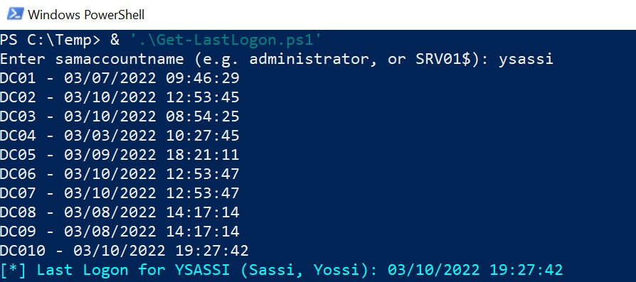

# Get-LastLogon
One-liner that gets the last logon for an account (user or computer) from all DCs. no dependencies, no special permissions, just LDAP connectivity. 
 
* TIP: use this LoTL powershell oneliner to FIND the samaccountname of a user, based on free text search/ambiguous name resolution on AD objects:
  ([adsisearcher]"(anr=sassi)").FindAll() | % {"$`
  ($_.Properties.cn):$`
  ( $_.Properties.samaccountname)"}
   
